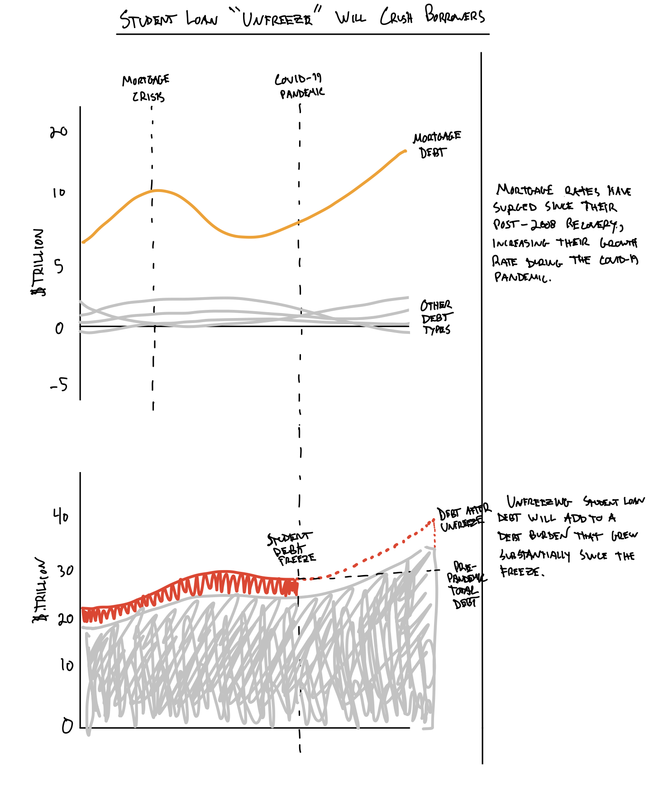

| [home page](https://iankloo.github.io/Portfolio) | [visualizing debt](visualizing-government-debt) | [critique by design](critique-by-design) | [final project I](final-project-part-one) | [final project II](final-project-part-two) | [final project III](final-project-part-three) |

# Assignment 4: FiveThirtyEight Visualization Redesign

In this assignment, I will attempt to recreate a visualization from FiveThirtyEight that I don't think works well. This is dangerous territory as I generally find FiveThirtyEight aesthetically excellent, so finding ways to improve their work will be difficult.

## The Original Visualization

The following visualization appeared in the [a FiveThirtyEight article](https://fivethirtyeight.com/features/how-restarting-student-loan-payments-could-change-millions-of-lives-and-the-economy) that focuses on some of the expected economic effects of unfreezing student loan debt.  When the COVID-19 pandemic began, student loan debt was frozen, effectively removing it from peoples' debt burden (it did not accrue interest).  Additionally, the Biden administration had stated a policy goal of absolving student loan debt, so many people did not prioritize paying off their student loan debt.  In fact, many people took on a bunch of additional debt for various reasons (e.g., rents were raised, so more people bought houses).  

Here is the visualization in question:

The article discusses several issues, but this visualization is offered in support of the argument that many borrowers increased their debt burden during the pandemic, and restarting student loan payments will make it so many people will not be able to afford to pay the interest on their debt.  

## Original Critique

There are several things that I would change about this visualization immediately:

### 1. Color

The colors used in this visualization do a decent job of differentiating the categories, but it is unclear why this specific color palette was used.  The author is trying to communicate something negative (people will not be able to pay their debts), so using traditional color tropes like "red = bad" might actually be useful here.

### 2. Typeface

Several different typefaces were used in this visualization.  It is easy to see this by focusing on the "Q's" used throughout.  The legend titles, annotation, and x-axis all clearly use different typefaces.  This should be consistent in a single visualization.

### 3. X-Axis

It is nearly impossible to tell where the x-axis labels are pointing because they are very long, and there are no grid lines or hash marks.  Moreover, all of the labels include "Q2" which is redundant.  

### 4. Chart Type

This is a stacked bar chart, but the bars are spaced close together, which creates an area chart-like look.  This kind of works, but bars create a stepping quality that is distracting.  

### 5. Data Deception (Series Order)

The series order does not make sense and is actually deceptive.  At first look, all of the debt types appear to be going up and to the right, but this is only because the mortgage debt is placed at the bottom of the chart.  In reality, mortgage debt was the only debt type that substantially increased.

## Initial Redesign (Iteration 1)

My first attempt at a redesign of this visualization is shown below:

These sketches were meant to address all of the issues I highlighted above.  I decided that this visualization was really trying to convey two key ideas: 1) mortgage debt grew during the pandemic, and 2) resuming student debt will add to an already large debt burden.

I reserved the red color for the student loan debt because this is the biggest issue the article mentions.  I wanted to call out mortgage debt to some degree, so I chose another color that sticks out (orange) but was less "severe" than red.  The rest of the debt is gray because it is not the focus.

I added some text to the right of the visualization because I found it necessary to convey the points I wanted to make.  Financial data is complicated and often unintuitive, so I wanted to provide more help for the user.

I thought that including the student debt on top of the second visualization would help show the effect on overall debt of freezing/unfreezing this debt type.

## Feedback Part 1

I brought these sketches to a graduate student with a non-technical (English literature) background for feedback.  She understood the story I was trying to tell, but it did not appear immediately obvious.  After explaining more of the background from the FiveThirtyEight article, she was confident in the conclusions she initially reached after looking at the visualizations.  Given that this article is intended to accompany a written article, I found this validation that these visualizations were not overly complex.

This reviewer focused her critique on the second visualization, which she found somewhat confusing at first glance.  She found the dotted lines unnecessary but was unsure what she would change to clarify things.  She also mentioned that it would be better to have this all in a single chart but agreed that it was probably too difficult to get everything in one plot without confusing things.

## Redesign Iteration 2

After this feedback, I redrew the second figure, pushing student loan debt to the bottom. This has the effect of "pushing" the overall debt higher when it is unfrozen in 2023:

After returning this to the initial reviewer, she agreed this was an improvement.

## Feedback Part 2

I received additional feedback from three additional reviewers (in class).  These were both students in a technical graduate program.  

All three reviewers commented that this would be much more powerful if it were a single visualization.  Additionally, they found the redesigned second figure confusing and needed significant explanation to understand the message I was trying to convey.  

I asked the reviewers for specific changes, and they all suggested highlighting mortgage debt and student debt, leaving the remaining debt types in gray.  Two reviewers also suggested that I shift to a bar plot.  The third reviewer thought that the area plot was a better choice.  I agreed to try both options to see what worked best.  

The reviewers also mentioned several things they liked, including the color palette and the annotations for the student loan freeze and the 2018 mortgage crisis.  

## Final Redesign

At this point, it was clear that I needed a full redesign from my sketches.  I had clearly identified some elements that I wanted to include in my final visualization, but I was struggling to put all of these things together into a single visualization.  After experimenting with several reviewer suggestions, I arrived at the final redesign:

This final version tells the story without while removing all unnecessary chart features from the original FiveThirtyEight design.  The two reviewers who suggested using bar plots were ultimately right, but to make this work, it was important to aggregate the data to the year level.  The initial data had a bar for each quarter.  This level of granularity did not add anything and just created visual confusion.  

After shifting to bars, adding the student loan series to the top of the bars was effective in showing the additional debt that would result from unfreezing student loans.

In total, I used meaningful colors (including grouping several loan categories), standardized the typeface, clarified the x-axis, selected a better chart type, and modified the series order.  Additionally, I added some useful annotations, improved the title/subtitle, and added interactivity (clicking one of the loan types in the legend will hide it).

I think that my final visualization is not only an aesthetic improvement over the original but also does a better job conveying the data.  The author of the FiveThirtyEight article makes a point of focusing on mortgage debt in another part of the article but then suggests with this plot that the debt increase during the pandemic was universal.  I think this is a case where the author was actually misled by their own visualization.  Before this assignment, I had not considered the importance of series ordering in a stacked bar (or area) chart, but this will definitely be something I am careful with in the future.

