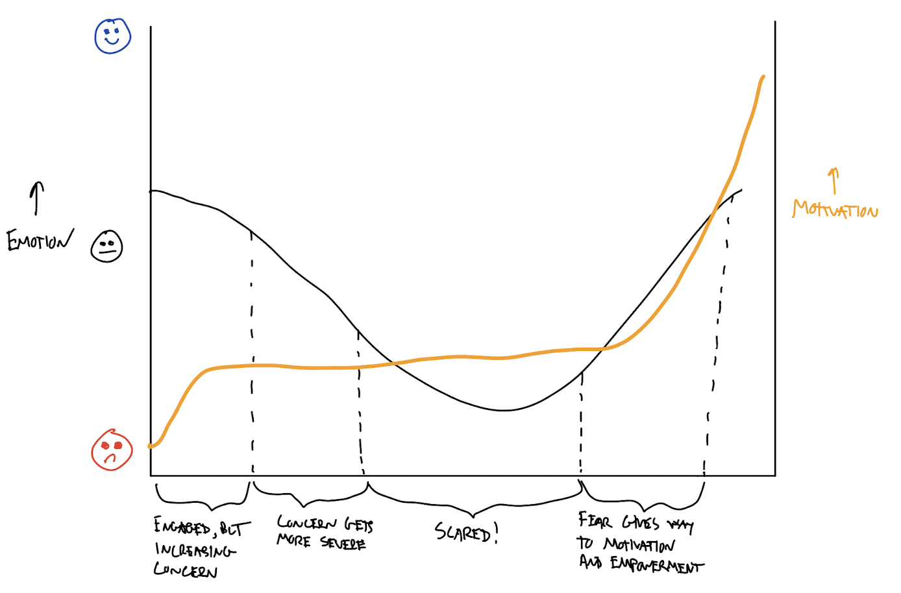
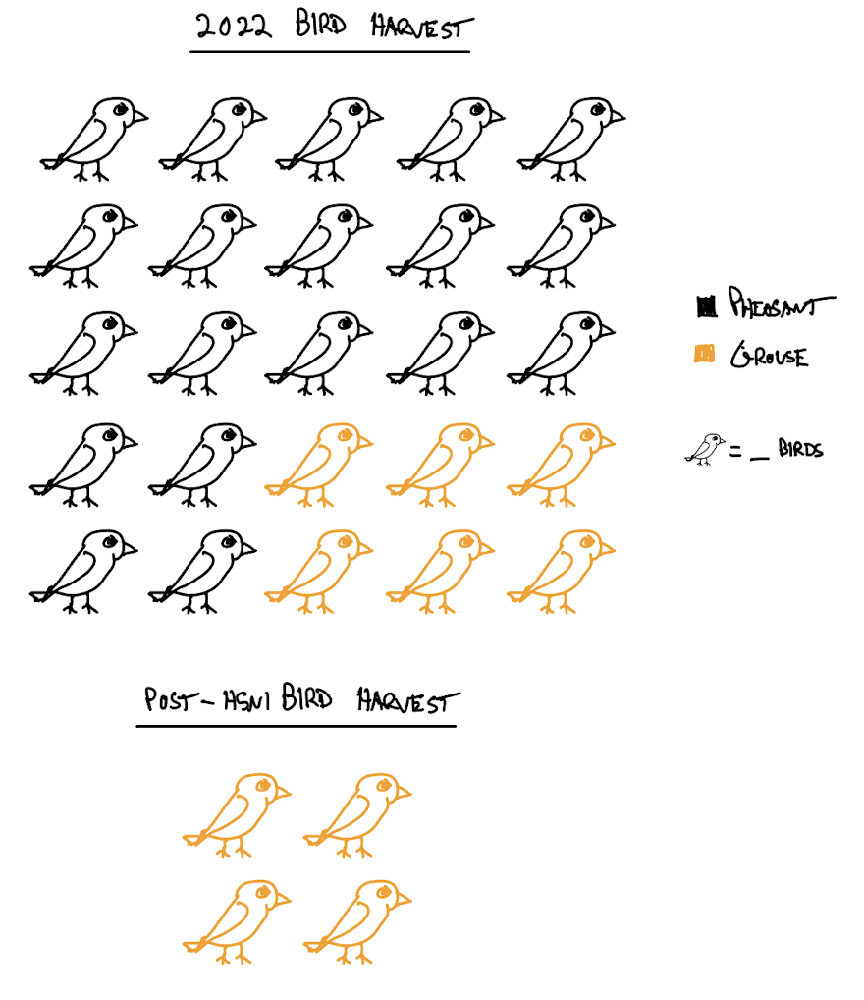
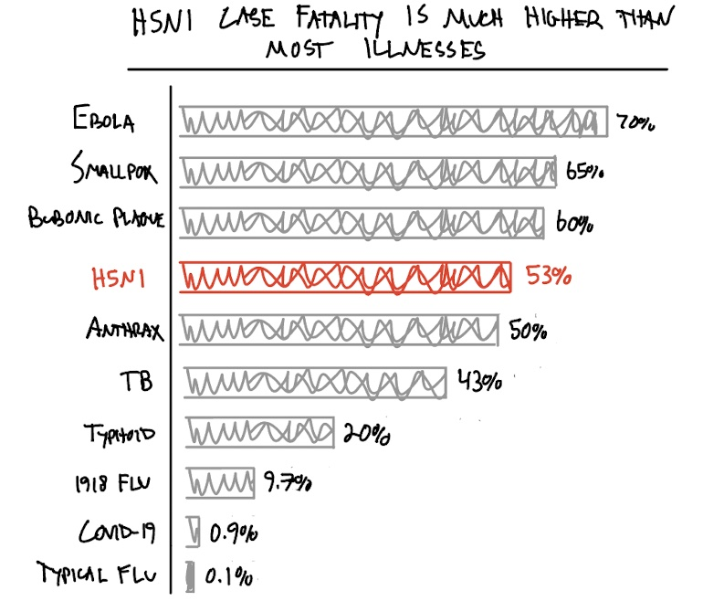
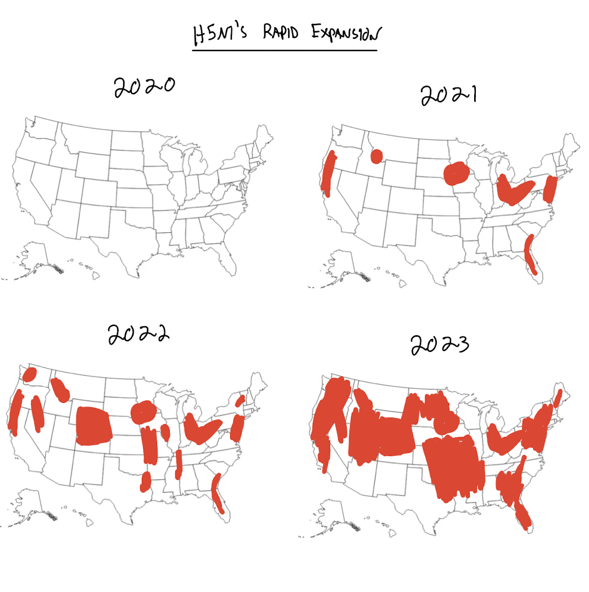
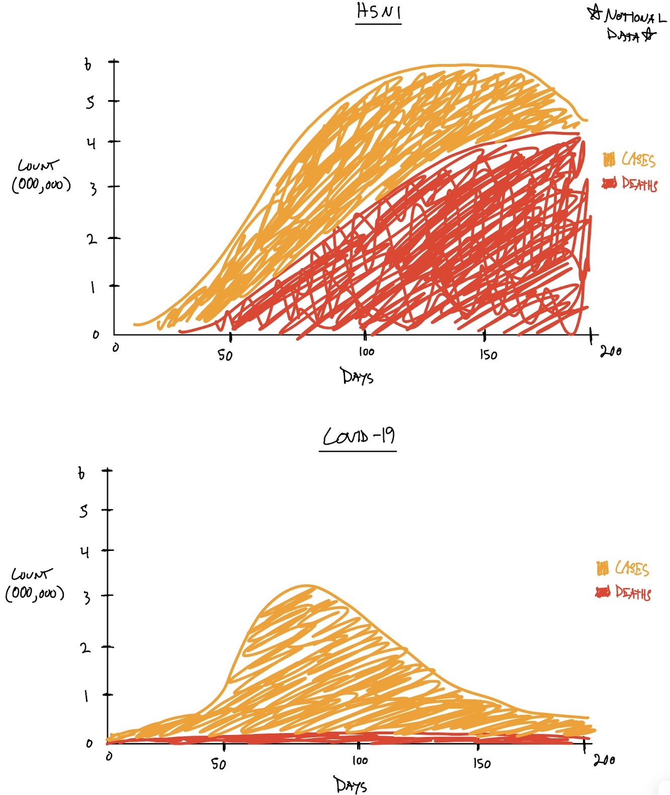

| [home page](https://iankloo.github.io/Portfolio/) | [visualizing debt](visualizing-government-debt) | [critique by design](critique-by-design) | [final project I](final-project-part-one) | [final project II](final-project-part-two) | [final project III](final-project-part-three) |

# Project overview

## Concept: bird hunters - our first line of defense against another global pandemic.

As COVID-19 makes its resurgence this fall, it is important to keep in mind the danger that respiratory viruses can pose.  Many of us recall the H5N1 (bird flu) outbreaks, starting in the mid 1990's and recurring in the early 2000's.  These flu surges might seem inconsequential compared to COVID-19, but that point of view is misguided.  H5N1 had a 50% fatality rate in humans when it first emerged and it upended the poultry industry with a nearly 100% bird fatality rate.  

Unfortunatly, H5N1 is on the rise again in wild bird populations.  And this all comes as bird hunting season is about to open for the fall - dramatically increasing the number of bird-human interactions.  

I am a bird hunter myself and I have not been targeted with any information about H5N1.  At the same time, I receive regular emails with information about CWD (chronic wasting disease) in deer and advice for mitigation strategies.  CWD is critically important, but it has never spread to humans.  At the same time, we have a circulating pathogen that has the demonstrated potential to kill humans at an alarming rate and upend economies by destroying domestic bird populations.  

Fortunately, the livestock industry is actively trying to mitigate risks from H5N1; however, there has been little effort to educate another group that regularly comes into contact with sick birds: hunters.  The goal of my project is to motivate hunters to care about Highly Pathenogenic Avian Influenza (HPAI) - like H5N1 - so that they can take the necessary actions to reduce the risk to humans, livestock, and the domesticly raised and introduced (stocked) birds that are critical for species reintroduction.  Pretending this isn't a problem might work...or we might end up with another, much more deadly, global pandemic.  

## Outline

Here is my general outline for how I will present this story.  The words in brackets are the emotinos I am trying to evoke.

0. **[interested and concerned]** Hook - this is for hunters and it threatens your hobby and your life!
1. **[inellectually engaged]** History of H5N1 flu 
    a. Mid 90s outbreak
        &nbsp;&nbsp;&nbsp;&nbsp; i. Highlight the 50% fatality rate and rapid spread.
        &nbsp;&nbsp;&nbsp;&nbsp; ii. Highlight how lucky we are that we didn't have a global pandemic.
    b. Recurrence in 2000's
        &nbsp;&nbsp;&nbsp;&nbsp; i. Highlight damage to domestic birds

2. **[concerned]** Current state of H5N1 in the bird population
    a. Highlight rapid growth

3. **[scared]** Projected (scary) future scenarios

4. **[empowered]** What you can do as a hunter
    a. Protect yourself and your family
    b. Protect wild birds 
    c. Contribute to surveillance

The overall emotional story arc will look something like:

Looking at emotion first, I expect people will start off somewhat neutral about the whole the issue.  They will quickly become dismayed by the (scary) information that I will present in the first few sections.  By the time I am showing future projections, they should be fully scared.  The last section will try to channel this fear into empowerment, leaving the reader more informed and more likely to act.  Importantly, my goal is not to leave the reader dismayed.  I also am not trying to make the user especially positive about the issue, as this would detract from the motivation (this is a scary thing - people should be cautious but empowered).

I also wanted to show motivation on this plot.  We can see that the user starts with low motivation (as most hunters don't care about this issue).  They increase motivation immediately after learning this is an issue for hunters.  Most of the middle content will not motivate them because it does not provide any recommendations for what to actually do.  In other words, these middle sections are setting up the final section so that the readers care enough to become motivated.  In the end, the reader should be motivated to take action.

## Initial sketches

Here are some initial ideas for visualizations addressing my major sections/ideas listed above:

1. Potential affects of H5N1 on game birds
The idea here is to depict the large number of game birds that are harvested in PA every year.  The farmed pheasant (stocked) birds will be shown separately from the wild grouse.  H5N1 has 100% fataility rate on farmed birds but is less effective at infecting wild birds, so it will kill fewer of them.  The idea is to get hunters to stop and think, "uh oh, there will be way fewer birds out there."

2. H5N1 human case fatality rate compared to other common viruses
The idea is to show people how deadly H5N1 was in the 90's compared to other viruses that they typically encounter.

3. Map of H5N1 over the last year
Show how much H5N1 is growing.

4. Potential future timeline of modeled human cases and deaths.
Here I will show the projected case/death curves compared to what actually happened with COVID-19.

The visualizations presented here are in their early phases of development, but I think they capture a decent diversity of different visualization concepts.  I anticipate making significant improvements - and even changing some of the chart types completley - as I continue to think about this project and receive feedback from others.  These initial ideas are meant to "fail fast" so that I can get to the necessary iteration process.  

## Data

I will need to use a number of different data sources for this project.  First, I will need to find the data on the historical H5N1 flu to communicate the historical context of this virus (and show how scary it is).  There are quite a few sources on this (listed below).  I also found data on the current H5N1 situation in wild bird populations in the United States.  

The future scenario will require some simulation to show a plausible worst-case scenario if things go poorly.  My current plan is to run a SEIR model using an existing web tool like: https://gabgoh.github.io/COVID/index.html.  In a pinch, there are also some R packages that make it fairly easy to run SEIR models and I have a little bit of experience in the domain.

For hunter motivation, one of my main arguments will be that H5N1 poses a risk to the stocked bird populations (as these are technically "domestic" birds that are released as part of reintroduction programs).  In other words, if we start losing birds, we start losing hunting opportunities.  I will list a data source showing the number of birds that are stocked in PA by county.  I may also bring in information about grouse, which have been making a comeback in PA, but could be put at risk if H5N1 takes off.  

Most (all?) of the hunter information is available at the state level (vice the federal level) because each state's department of conservation is different and somewhat isolated.  I may bring in information from neighboring states (e.g., New York), but will probably limit myself to a few states if I reach beyond PA.

| Name | URL | Description |
|------|-----|-------------|
|Current H5N1 (CDC)      | https://www.cdc.gov/flu/avianflu/data-map-commercial.html    |  CDC's information on H5N1 in wild and domestic birds           |
| SEIR Simulator for Pandemics      | https://gabgoh.github.io/COVID/index.html    | A simulator where I can put in the H5N1 parameters to generate likely future scenarios.            |
| HPAI in wild birds     | https://www.aphis.usda.gov/aphis/ourfocus/animalhealth/animal-disease-information/avian/avian-influenza/hpai-2022/2022-hpai-wild-birds    |  USDA's data on wild bird incidence of HPAI           |
| Grouse Harvest Data | https://www.pgc.pa.gov/Wildlife/WildlifeSpecies/Documents/Grouse%20and%20Woodcock%20Status%20Report.pdf | Historical grouse harvest data back to 1965 in Pennsylvania | 
| CDC Historic H5N1 Data | https://www.cdc.gov/flu/avianflu/timeline/avian-timeline-1960-1999.htm | CDC's resources on the history of H5N1 in birds and humans | 
| Common disease fatality | https://en.wikipedia.org/wiki/List_of_human_disease_case_fatality_rates | Case fatality rates (CFR) for known diseases |

## Method and medium

1. Data capture and manipulation

I will write R or Python scripts that go out to the listed data sources, download the data, and do all necessary pre-processing steps.  I will commend this script heavily and it should provide a fully-reproducable pipeline to recreate my work.

2. Visualization

I have had some luck with Flourish, so I will start there.  Some of my visualization ideas may be difficult (or impossible) to implement on Flourish, so I will also consider using something like D3 to generate more unique plots.  The real challenge will be unifying the aesthetics if I end up generating visualizations on multiple platforms.  I will have to pay close attention to color scales, typefaces, etc. to make sure things look like they came from the same design principles.  

3. Final product

I plan to use Shorthand to put everything together.  I don't have experience with the platform, so I suppose I may run into something that motivates me to switch to an alternative.  I doubt this will be an issue - I will almost definitely end up using Shorthand.

